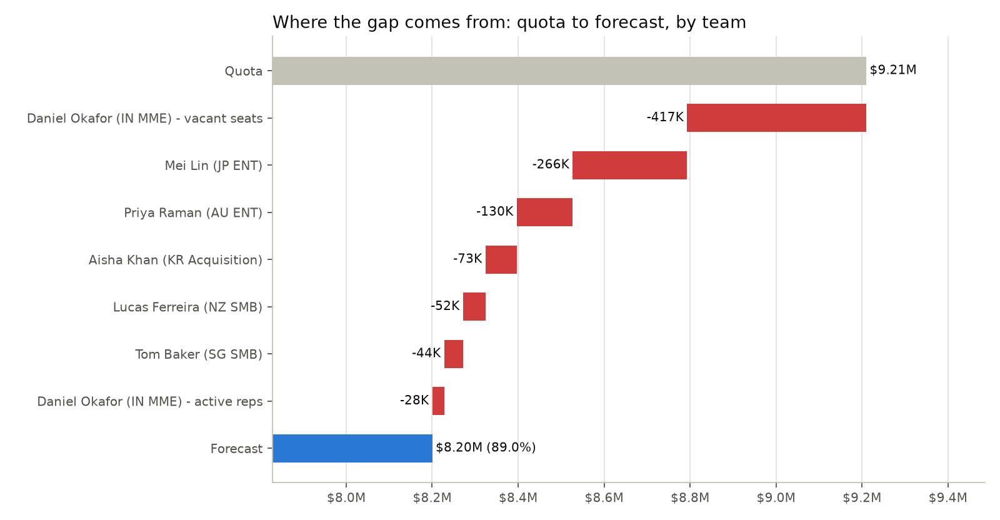
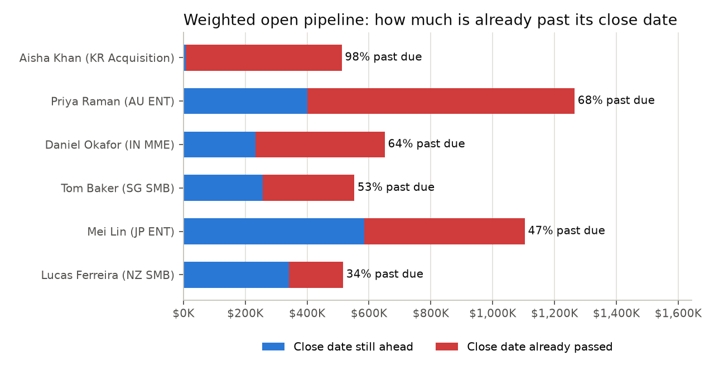

# Forecast Diagnostic Toolkit

**"Why is the region missing its number, where, and what should we do about it?"**

A re-runnable sales-forecast diagnostic for Sales Operations teams. It takes two ordinary CRM exports
(opportunities and a rep roster), validates and cleans them, reconciles the forecast, finds where the gap
sits, and produces an action plan, an Excel workbook and a short briefing for a VP.

It is built around one rule: **the code does the maths, the AI only explains it**, and every number in an
AI-written summary is checked back against the data before anyone sees it.

```
opportunities.csv + rep_roster.csv
  → 1. clean & validate    21 automated checks; every fix logged with the rows and $ it changed
  → 2. reconcile           every plausible roll-up vs the reported number, on raw and clean data
  → 3. diagnose            quota→forecast bridge; team / market / segment / rep / stage / cohort cuts
  → 4. act                 past-due deals, deals with no owner, category fixes, stalled deals, coaching flags
  → 5. summarise           a briefing written from a facts pack, with every number verified
  → outputs/               Excel workbook (18 tabs), charts, summary.md, facts.json
```

On the bundled sample data the answer comes out as:

> **APAC is forecasting $8.20M against $9.21M quota (89.0%), a gap of $1.01M.** 70% of the gap sits in two
> teams. 2 vacant seats carry $640K of quota with only $223K forecast against them, and 161 of 271 open deals
> are past their close date, holding 60% of the weighted pipeline. If those deals close at half their stated
> odds the region lands at 74%, so the quarter is called as a range: **74% to 89%**.



## Why it exists

A forecast roll-up is only as good as the fields underneath it. In most CRM exports some deals are
duplicated, some amounts never got converted from local currency, country names are typed by hand, date
fields mean different things in different rows, and the rep's own "Commit" flag does not track reality.
Add those up without looking and you get a number nobody can defend.

This toolkit refuses to produce a number before the inputs are validated, shows which roll-up reproduces the
number leadership is quoting, and separates **structural** causes (a seat with quota and nobody in it) from
**execution** causes (stale pipeline, losses, rep performance), because a VP acts on them differently.

## Quickstart

```bash
pip install -r requirements.txt

python data/generate_sample_data.py   # optional: regenerate the synthetic sample data
python forecast_diagnostic.py         # full run; writes everything to outputs/
streamlit run app.py                  # the dashboard, then drop the two CSVs in
```

Or open [`notebooks/walkthrough.ipynb`](notebooks/walkthrough.ipynb) to step through the pipeline with the
results already rendered.

## The dashboard

`streamlit run app.py` opens a six-page dashboard in the browser, ordered the way a VP asks the questions:

| Page | Answers |
|---|---|
| **Overview** | Will we hit the number? The forecast, what it is made of, and a what-if slider for stale deals |
| **Teams** | Where is the gap? By manager, market or segment, down to each rep and the deals to work |
| **Pipeline** | How healthy are the deals? Late deals by stage, by cohort, and a team × stage heatmap |
| **Data trust** | Can we trust the number? Every check, what was fixed, and which roll-up reproduces the reported % |
| **Actions** | What do we do? A 14 / 30 / 60-day plan with owners, plus deal lists each manager can download |
| **Ask AI** | Ask a question in plain English (optional, needs an API key) |

## How the forecast is defined

```
forecast = Closed Won (full value) + Σ(open deal amount × win probability)
```

The self-reported `forecast_category` is **audited but never used for the number**. In the sample data,
Commit, Best Case and Pipeline deals all carry roughly the same average win probability, and a category
roll-up lands 18 points away from the stage-based one:


## What it checks

| Fixed automatically (the data can answer it) | Flagged for a person (only they can) |
|---|---|
| Exact duplicate rows, and duplicate IDs with conflicting values | Blank forecast category |
| `amount_usd` not converted at the currency's rate | Open deals whose close date has already passed |
| Country spelled out instead of the roster's code | Open deals owned by a vacant seat |
| `age_days` inconsistent with the dates (including negatives) | "Commit" on an early-stage deal; late-stage deals marked Omitted |
| | Closed Lost with no loss reason; one account name under several IDs |

Every fix is written to a data-quality log with the rows and dollars it changed, so the cleaned number stays
auditable:



## Where AI is used, and where it is not

| Step | Who does it |
|---|---|
| Cleaning, validation, every calculation, the action plan | **Code only.** No AI involved |
| The VP briefing | Claude writes prose **from a pre-computed facts pack**, then `verify_numbers()` checks every figure in the text against that pack. A draft with an untraceable number is rejected and the deterministic template is used instead |
| "Ask AI" page | Claude chooses among 8 analysis tools that query the validated data; the code computes every number, and each answer shows the tools it used |

The AI features are **optional**. Without an API key the toolkit, the dashboard and the deterministic
summary all still work, and the output records which path was used. To enable them, copy `.env.example` to
`.env` and add your own key (`.env` is git-ignored).

## Sample data

The files in `data/` are **synthetic**, produced by [`data/generate_sample_data.py`](data/generate_sample_data.py)
with a fixed seed. Teams, reps, accounts and amounts are invented, and the data-quality problems are planted
on purpose so the diagnostic has something to find: 469 rows for 29 seats across 6 teams and 6 currencies.

Your own export needs these columns:

- **Opportunities:** `opp_id, account_id, account_name, segment, country, rep_name, manager_name, deal_type,
  pipeline_stage, forecast_category, created_date, close_date, age_days, amount_local, currency, amount_usd,
  win_probability, loss_reason`
- **Rep roster:** `rep_name, manager_name, country, segment, quota_usd, tenure_months, headcount_status,
  historical_attainment_pct_q_minus_1, historical_attainment_pct_q_minus_2`

## Configuration

Everything that changes per quarter or per region lives in `config.json`, not in the code: file paths, region
name, the reported forecast %, stage names, FX handling, country spellings, the active headcount status, and
the thresholds (stalled age, chronic underperformance, Commit minimum win probability, rep concentration,
past-due haircut). `"auto"` means the toolkit infers the value from the data and prints what it inferred.

## Repo layout

```
forecast_diagnostic.py        the engine: clean, reconcile, diagnose, act, summarise
app.py                        Streamlit dashboard
agent.py                      the 8 analysis tools and the tool-using agent behind "Ask AI"
config.json                   everything that changes per quarter
prompts/vp_summary_prompt.md  the system prompt for the AI summary (tone and format live here, not in code)
data/                         the synthetic sample data and the generator that makes it
notebooks/walkthrough.ipynb   the pipeline, step by step, with results
docs/                         sample summary and the charts used above
```

## Limitations and what I would add next

- The number verifier catches figures that do not exist in the data, but not a real figure attached to the
  wrong claim. A human still reviews the summary.
- FX rates are inferred from the data. In production, read the finance rate table instead.
- Column names are fixed; a column-mapping block in the config would handle other CRM exports.
- No automated tests yet. Next: a synthetic dataset with planted issues asserting that each check fires
  (the generator here is the first half of that).
- Scheduling and distribution (a weekly run that emails each manager their own list) are not built.

## License

MIT, see [LICENSE](LICENSE).
