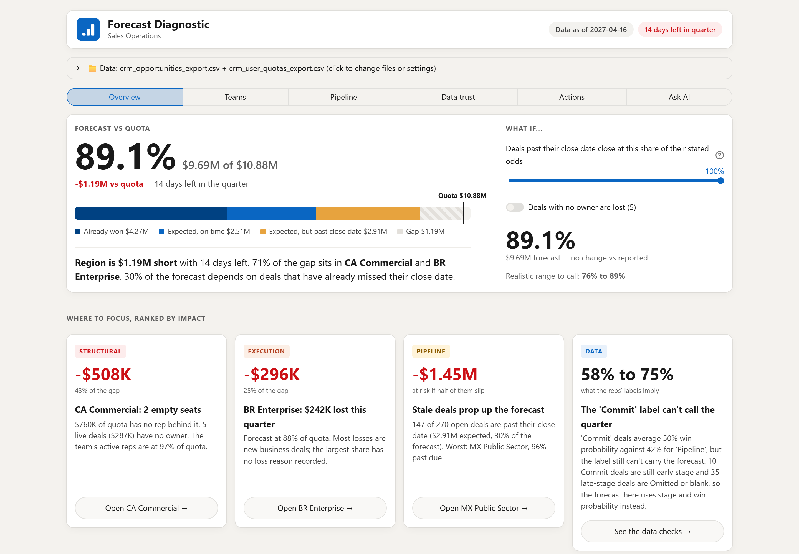
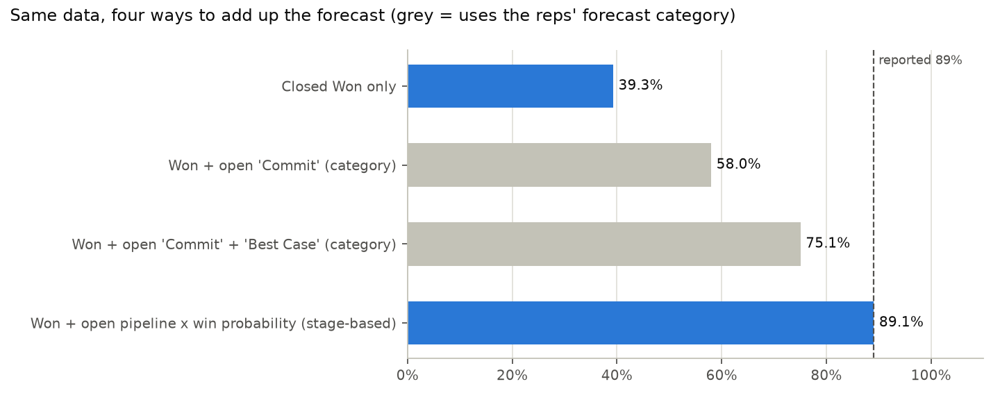
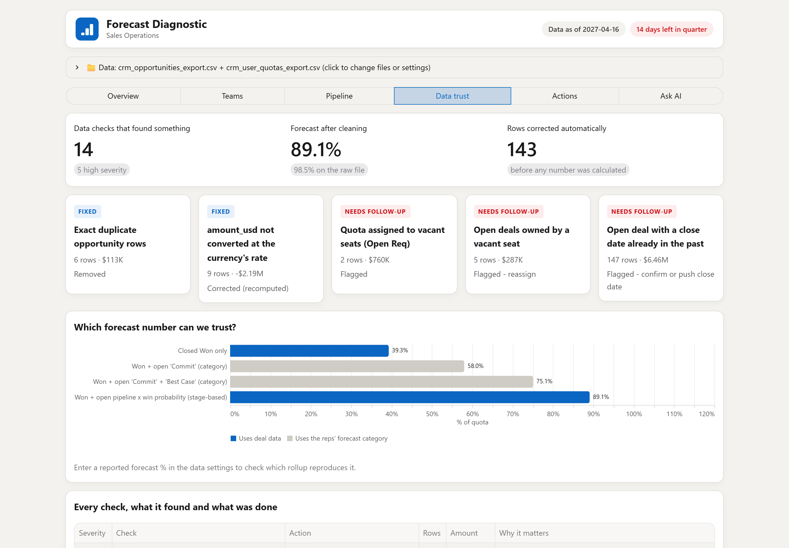
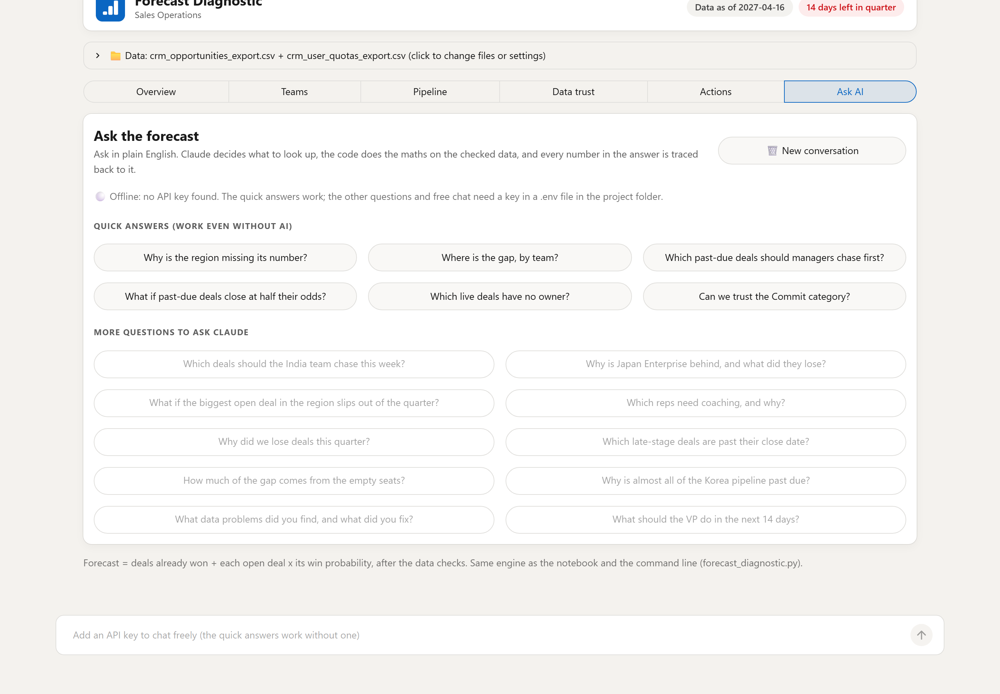

# Sales Operation Toolkit

### A forecast diagnostic that cleans the data, reconciles the number, finds the gap, and lets AI explain it — never calculate it.

[](https://github.com/NeginZarbakhsh/SalesOperationToolkit/actions/workflows/ci.yml)
[](https://www.python.org/)
[](LICENSE)
[](tests/test_pipeline.py)

Point it at two ordinary CRM report exports — opportunities and user quotas — and it answers the question a
VP of Sales actually asks: **why are we missing the number, where exactly, and what do we do in the next 14
days?** The sample files are shaped like a Salesforce report export; any other CRM is a mapping in
`config.json`, not a code change.



---

## The problem

A forecast roll-up is only as good as the fields under it. In a typical export, some deals are duplicated,
some amounts never got converted from local currency, country names are typed by hand, a date field means
two different things in different rows, and the rep's own "Commit" flag does not track reality. Add that up
without looking and you get a number nobody can defend — and a leadership team focused on the wrong team.

## The answer this produces

Run it on the bundled synthetic data and you get, in about two seconds:

| | |
|---|---|
| **Forecast** | **$9.69M against $10.88M quota = 89.1%**, a gap of $1.19M with 14 days left |
| **Where** | 71% of the gap is in two of six teams |
| **Why (structural)** | 2 empty seats carry $760K of quota with $252K forecast against them: 43% of the gap, while that team's active reps are at 97% |
| **Why (pipeline)** | 147 of 270 open deals are past their close date, holding 54% of the weighted pipeline |
| **Why (data)** | 10 "Commit" deals are still early stage and 35 late-stage deals are marked Omitted or blank; a category roll-up lands 31 points off the stage-based number (58% vs 89%) |
| **So what** | Call the quarter as a range, **76% to 89%**, and work the 5 ownerless deals and 44 past-due Negotiation/Review deals first |

Every one of those numbers is computed in code, logged, and covered by a test.

## How it works

```mermaid
flowchart LR
    A["CRM report exports<br/>opportunities + user quotas"] --> M["1 · Map columns<br/>config.json, any CRM"]
    M --> B["2 · Clean &amp; validate<br/>21 checks, every fix logged"]
    B --> C["3 · Reconcile<br/>which roll-up gives the reported %?"]
    C --> D["4 · Diagnose<br/>team · market · segment · rep · stage · cohort"]
    D --> E["5 · Act<br/>14/30/60-day plan, deal lists"]
    E --> F["6 · Summarise<br/>facts pack → AI draft → number check"]
    F --> G["Dashboard · Excel · charts · summary.md · facts.json"]
```



**1 · Read any CRM export.** The `columns` block in `config.json` maps the export's own headers (`Id`,
`StageName`, `ForecastCategoryName`, `Probability`, `Account.BillingCountry`, `Quota_USD__c` ...) onto the
toolkit's field names, converts a 0-100 probability to 0-1, and names the exact column to map if one is
missing. Stage names come from the config too, so a stage called "Negotiation/Review" needs no code change.

**2 · Clean and validate.** 21 automated checks. Problems the data itself can answer are fixed and logged
with the rows and dollars they moved (duplicate rows, unconverted currency, country names, a broken age
field). Problems only a person can answer are flagged, never guessed (blank categories, close dates already
in the past, deals owned by an empty seat).

**3 · Reconcile.** Every plausible way of adding up the forecast is computed on both the raw and the cleaned
data, and compared with the number leadership is quoting, so the analysis starts from a number that can be
defended:

```
forecast = Closed Won (full value) + Σ(open deal amount × win probability)
```

The self-reported forecast category is audited but never used for the number: in the sample data a Commit
roll-up lands 31 points away from the stage-based one, and 10 deals flagged "Commit" have not even reached a
late stage.



**4 · Diagnose.** A quota → forecast bridge by team, with vacant seats split out from active reps, plus cuts
by market, segment, rep, pipeline stage and deal cohort. Structural causes are separated from execution
causes because a VP fixes them differently.

**5 · Act.** Rule-based 14 / 30 / 60-day plan with an owner per action, and per-manager deal lists (no
owner, past due, label mismatch, stalled) exported to Excel and CSV.

**6 · Summarise.** A briefing a VP can read in a minute, with the AI kept on a short leash (below).

## Where AI is used — and where it deliberately is not

| Step | Who does it |
|---|---|
| Cleaning, validation, every calculation, the action plan | **Code only.** No model involved |
| The VP briefing | Claude writes prose **from a pre-computed facts pack**, then `verify_numbers()` re-checks every figure in the text against that pack. A draft containing a number that cannot be traced is **rejected** and the deterministic template is shipped instead |
| The "Ask AI" page | A tool-using agent: Claude picks among **8 analysis tools** that query the validated data, the code computes every number, and each answer shows the tools it called plus a per-number trace |

This is the part I care most about. An LLM that writes a confident wrong number is worse than no summary at
all, so the model never sees a calculator and never sees raw rows it did not ask for:

```python
text  = ai_summary(facts, cfg)          # the model only writes prose
check = verify_numbers(text, facts)     # every $ , % and count is matched back to the facts pack
if not check["verified"].all():         # one untraceable number and the draft is dropped
    text = template_summary(facts)
```

The guardrail is covered by a test that feeds it invented numbers and asserts they are caught
([`tests/test_pipeline.py`](tests/test_pipeline.py)).

The AI features are **optional**: with no API key, the toolkit, the dashboard and the deterministic summary
all still work, and the output records which path was used.

## The dashboard

`streamlit run app.py`, then drop the two CSVs in. Six pages, in the order the questions get asked:

| Page | Answers |
|---|---|
| **Overview** | Will we hit the number? What the forecast is made of, and a what-if slider for stale deals |
| **Teams** | Where is the gap? By manager, market or segment, down to each rep and the deals to work |
| **Pipeline** | How healthy are the deals? Late deals by stage, by cohort, and a team × stage heatmap |
| **Data trust** | Can we trust it? Every check, what was fixed, which roll-up reproduces the reported % |
| **Actions** | What do we do? The 14/30/60-day plan and per-manager deal lists |
| **Ask AI** | Ask in plain English; the code answers, the model explains |

| Data trust | Ask AI |
|---|---|
|  |  |

## Quickstart

```bash
git clone https://github.com/NeginZarbakhsh/SalesOperationToolkit.git
cd SalesOperationToolkit
pip install -r requirements.txt

python data/generate_sample_data.py   # optional: rebuild the synthetic sample export

python forecast_diagnostic.py     # full run → outputs/ (Excel, charts, summary.md, facts.json)
streamlit run app.py              # the dashboard
pytest -q                         # 16 tests on the sample data
```

Optional AI features: `cp .env.example .env` and add your own `ANTHROPIC_API_KEY` (`.env` is git-ignored).

Prefer to read rather than run? [`notebooks/walkthrough.ipynb`](notebooks/walkthrough.ipynb) has the whole
pipeline with results already rendered, and [`docs/sample_summary.md`](docs/sample_summary.md) is the
briefing it produces.

## The sample data is synthetic

`data/` is generated by [`data/generate_sample_data.py`](data/generate_sample_data.py) with a fixed seed: an
invented North America region, 6 teams, 29 seats, 479 rows, 4 currencies, one fiscal quarter. The files carry
Salesforce-style headers, and the data-quality problems are **planted on purpose** so the diagnostic has
something to find. The planted counts are exactly what the tests assert. **No company data is used anywhere
in this repo.**

The opportunity export looks like this:

    Id, Name, AccountId, Account.Name, Account.BillingCountry, Segment__c, Owner.Name, Owner.Manager__c,
    Type, StageName, ForecastCategoryName, Probability, Amount, CurrencyIsoCode, ConvertedAmount,
    CreatedDate, CloseDate, Age_Days__c, Loss_Reason__c, NextStep, Fiscal_Quarter__c

and the user export carries `User.Name, Manager.Name, Territory_Country__c, Segment__c, Quota_USD__c,
Tenure_Months__c, User_Status__c, Attainment_Prior_Q1__c, Attainment_Prior_Q2__c`.

To run it on your own export, edit the `columns` block in `config.json` so each toolkit field points at your
column name. Nothing else changes.

## Design decisions worth calling out

- **Config over code.** Column mapping, stage names, FX handling, country spellings, thresholds, the reported
  forecast % and the AI settings all live in `config.json`. `"auto"` means the toolkit infers the value (snapshot date,
  quarter dates, FX rates) and prints what it inferred, so next quarter is a config edit, not a code edit.
- **Fix vs flag.** A fix is only applied when the data can prove the right answer. Everything else is
  surfaced as a decision for a human, with the rows and dollars attached.
- **Stage × win probability, never the self-reported category.** The category is audited in its own view so
  the reader can see *why* it is not trusted.
- **Structural ≠ execution.** Vacant seats are separated from rep performance everywhere, including in the
  bridge chart, because they lead to different actions (hire vs coach).
- **Deterministic first, AI second.** Every output exists without an API key; the model improves the prose,
  not the numbers.
- **Tested and wired to CI.** The sample data has a fixed seed, so a change that moves the forecast fails a
  test instead of quietly changing a number in a report.

## Project structure

```
forecast_diagnostic.py        the engine: clean → reconcile → diagnose → act → summarise
app.py                        six-page Streamlit dashboard
agent.py                      8 analysis tools + the tool-using agent behind "Ask AI"
config.json                   everything that changes per quarter or per region
prompts/vp_summary_prompt.md  system prompt for the AI briefing (tone and format live here, not in code)
data/                         synthetic sample data + the generator that makes it
notebooks/walkthrough.ipynb   the pipeline step by step, with results
tests/test_pipeline.py        16 end-to-end tests, run in CI on 3.11 and 3.12
docs/                         sample briefing and the screenshots above
```

## Limitations, and what I would build next

- The number verifier catches figures that do not exist in the data, but not a real figure attached to the
  wrong claim; a human still reviews the briefing.
- FX rates are inferred from the data. In production, read the finance rate table.
- Not yet built: a scheduled weekly run that emails each manager their own list, and hosting behind SSO.

## About

Built by **Negin Zarbakhsh** as a study of how far a Sales Ops workflow can be automated while keeping every
number auditable. Feedback and issues are welcome.

MIT licensed — see [LICENSE](LICENSE).
